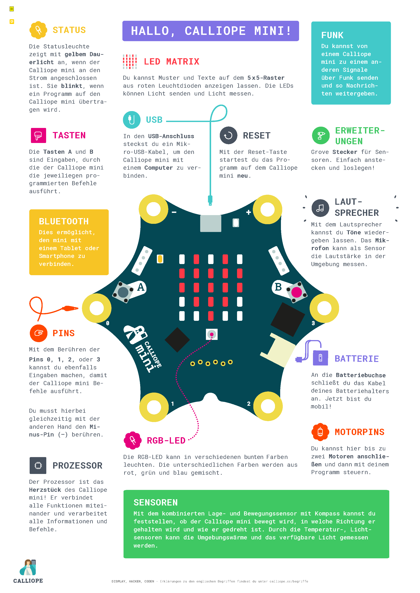

# Der Calliope im Überblick

## Sensoren

1. Temperatursensor  
   Der Temperatursensor gibt die aktuelle Temperatur des Prozessors an.  

2. Lichtsensor  
   Die LED-Matrix dient gleichzeitig als Helligkeitssensor mit einer Werteskala zwischen 0 und 255 (0 = dunkel, 255 = max. hell).  

3. Kompass  
   Ein eingebautes Magnetometer kann als Kompass genutzt werden. Es liefert Werte von 0 bis 360 (Grad). 

4. Mikrofon  
   Das eingebaute Mikrofon liefert Werte zwischen 0 und 100 (Prozent).  

5. Neigungssensor

6. Bewegungssensor

7. Kompass

## Weitere Ein- bzw. Ausgabe  
1. Lautsprecher  
2. Pins 0 - 3 (Datenpins)  
3. Pin Minus und Plus (externe Stromversorgung)  
